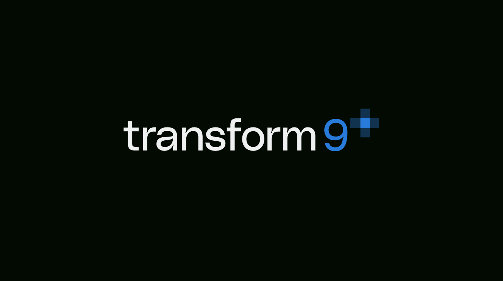
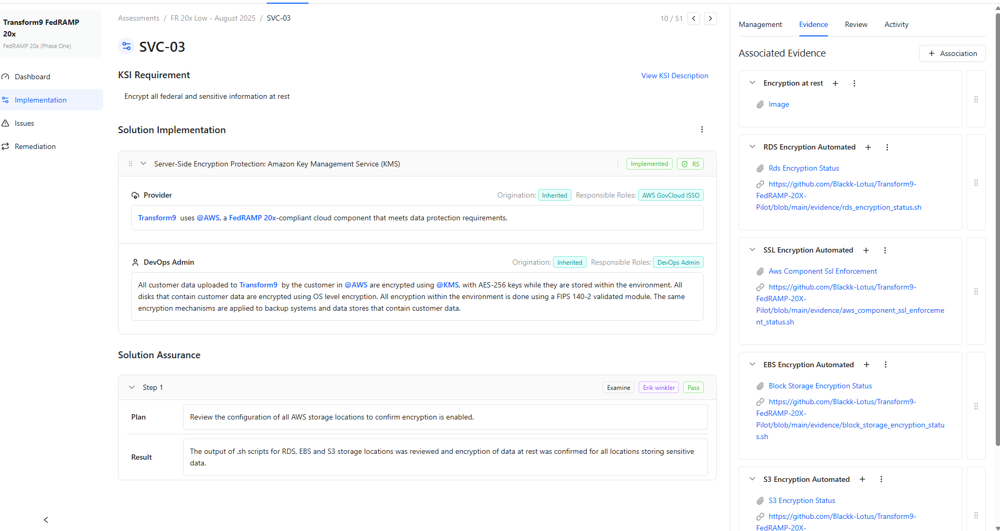
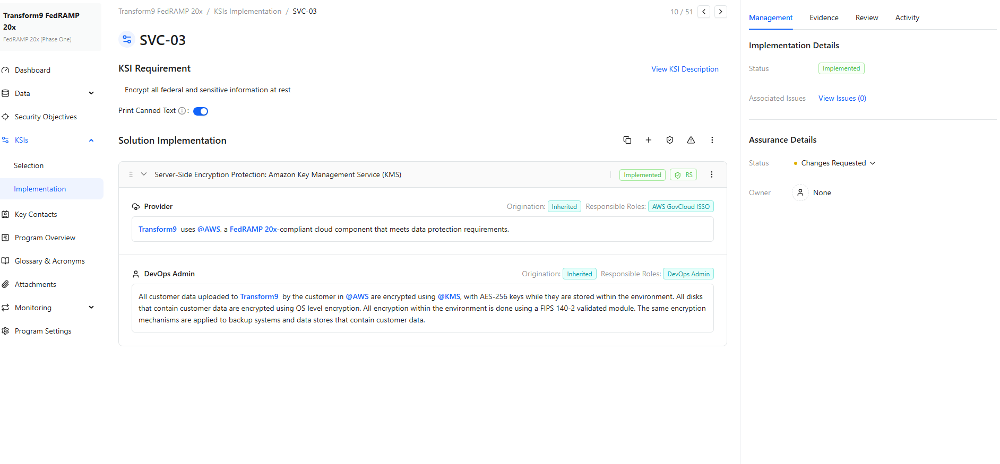
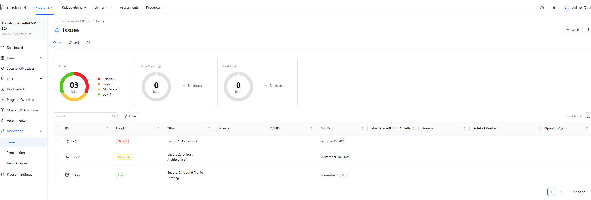
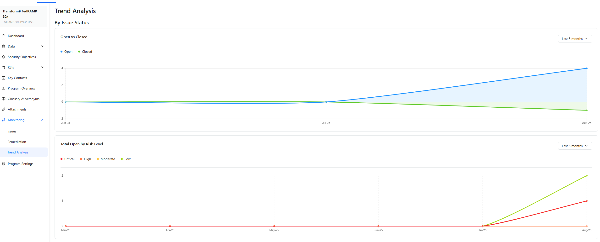

[](https://transform9.com)

# Transform9's FedRAMP 20x Phase One Pilot Final Submission

## Transform9 Overview

Transform9 delivers AI-powered voice agents that handle calls from start to finish—eliminating hold times, automating routine tasks, and improving responsiveness. We serve healthcare and other industries where timely, accurate communication is critical, managing scheduling, reminders, information requests, and more. By automating these interactions, organizations free staff to focus on higher-value work while improving the customer or patient experience.

- Conversational AI – Automates scheduling, reminders, information requests, and other call workflows.

- Flexible & Scalable – Serves healthcare and any sector with high-volume communications, adapting to unique operational needs.

- Seamless Integration – Connects with EHRs, CRMs, and other systems to keep information accurate and up to date.


## CSP Approach
Our approach can be summarized with the following steps:

### 1. Lightweight Documentation
Document the implementation of KSIs using Paramify Cloud with the FedRAMP 20x validations set.
### 2. Key Security Indicators and Validations
Gather and upload evidence into Paramify Cloud for each KSI validation, using automation where possible.

### 3. Validate Evidence
Meet with 3PAO and have them review and validate evidence in Paramify Cloud.

### 4. Automate Machine-readable Package
Generate and publish our machine-readable package using Paramify Cloud.

### 5. 3PAO Review
3PAO reviews the package and adds attestation.

### 6. Continuous Reporting 
Either on-demand or per an automated schedule, a new package will be generated with the most current evidence.

### 7. Prototype for Continuous Reporting
It is anticipated that Paramify Cloud will allow for a shareable link that shows the KSI dashboard.

### 8. CSP Rationale and Summary
Summary of and rationale for the approach used to generate the machine-readable file, and evidence generation methods.

### 9. CSP Submission
Similar to the Continuous Reporting capability, the package will be available either with a viewable link or through the machine-readable package file with a friendly HTML viewer.

# Step-by-Step Details

## Step 1 - Lightweigth Documentation

Document the implementation of our KSIs using Paramify Cloud with the FedRAMP 20x validations set.


## Step 2 - Key Security Indicators and Validations

Gather and upload evidence into Paramify Cloud for each KSI validation, using automation where possible. Instructions and commands for each evidence object are included to provide context to the evidence process and results.


Transform9 primarily uses bash scripts to call laaS/SaaS APIs and collect evidence for each FedRAMP 20X KSI. A selection of evidence scripts is included in the [evidence](./evidence) directory.

## Step 3 - Validate Evidence

Meet with 3PAO and have them review and validate evidence in Paramify Cloud. 3PAO can set Assurance steps/Results, Assurance Status, and leave notes or remarks





Transform9 is working with ControlCase as 3PAO for this FedRAMP 20X Assessment. The assessment report from ControlCase is available here:  [ControlCase Assessment](Images/ControlCase.pdf)

## Step 4 - Automated Machine Readable Package

Publish our machine-readable format package using Paramify Cloud’s DocRobot capabilities. Though YAML is our current proposal, Transform9 can support OSCAL, JSON, or other common formats.

# Assessment File Structure

The machine-redable assessment file is a YAML file with the following structure  (see [Assessment Schema](machine-readable-package/Schema.yaml))

```yaml

Package:
  CSPName: <Company name of Cloud Service Provider>
  CSO: <Cloud Service Offering / Name of application>
  impact: <Low | Moderate | High>
  summaryOfCSO: <Description of CSO>
  Assessments:
  - Assessment:
    digitalSignature: <SHA hash of assessment elements below>
    assessorOrg: <Third Party Assessment Organization>
    date: <date of assessment>
    leadAssessor: <name of lead assessor>
    recommendation: <Authorize | Do Not Authorize>
    remarks: <assessment remarks>
    KSIs:
    - KSI:
      name: <name of KSI>
      shortName: <shortname of KSI>
      status: <status of implementation - Complete | Incomplete>
      Validations:
      - validation:
        id: <validation id>
        shortName: <shortname of validation>
        description: <description of validation>
        implementation: <short description of approach>
        implementationStatus: <True | False | Partial>
        digitalSignature: <SHA hash of validation elements>
        assessmentStatus: <True | False | Partial >
        assessedBy: <name of assessor>
        assessedOn: <date validation was assessed>
        remarks: <remarks from assessor>
        Evidences:
        - evidence:
          id: <evidence id>
          name: <name of evidence>
          description: <description of evidence>
          instructions: <how to retrieve evidence>
          automated: <True | False>
          commands: <computer instruction used if automated>
          scriptName: <filename>
          validationRules:
          - rule:
            id: <rule id>
            textValue: <value to look for in output file>
          validatedBy: <name of assessor>
          validateDate: <date evidence was validated>
          remarks: <remarks from assessor>
          Artifacts:
          - artifact:
            name: <name of artifact>
            reference: <evidence file>
            outputResults: <output of script if automated>
            effectiveDate: <date of evidence>

```

### Below is the sample YAML file

```yaml

Package:
  CSPName: Amazon
  CSO: "Transform9 "
  impact: Low
  summaryOfCSO: ""
  Assessments:
    - Assessment:
        digitalSignature: ""
        assessorOrg: ControlCase
        date: 8/19/2025
        leadAssessor: Erik Winkler
        recommendation: ""
        remarks: ""
        KSIs:
          - KSI:
              name: Cloud Native Architecture
              shortName: CNA
              Validations:
                - validation:
                    shortName: CNA-01
                    description: Configure ALL information resources to limit inbound and outbound
                      traffic
                    implementation:
                      - >+
                        Title: Policy Enforcement Points: Amazon Firewall
                        Manager

                        Content: Transform9  leverages @AWS Security Groups, a
                        FedRAMP 20x-compliant component, for network access
                        control.


                        End User Responsibility: The @DevOps Admin employs @AWS
                        Security Groups for boundary protection in Transform9 ,
                        limiting use to allowed ports, protocols, and services.
                        Traffic to Transform9  is directed through AWS, featuring two access points:

                        the Transform9  web interface, requiring valid
                        credentials,

                        Transform9 admin access from authorized devices, secured
                        with two-factor authentication via @IAM and @Google
                        Authenticator.

                    implementationStatus: Implemented

```


Transform9's complete machine-readable file is available publicly in this repository at [text](machine-readable-package/transform9_controlcase_20x_machine_readable.yaml)


## Step 5 - 3PAO Review

3PAO reviews package and adds attestation. This is included at the Assessment level in the machine-readable-package

```yaml

  - Assessment:
    digitalSignature: <SHA hash of assessment elements below>
    assessorOrg: <Third Party Assessment Organization>
    date: <date of assessment>
    leadAssessor: <name of lead assessor>
    recommendation: <Authorize | Do Not Authorize>
    remarks: <assessment remarks>

```

## Step 6 - Continuous Reporting 

Either on-demand or per an automated schedule. a new package will be generated with most current evidence using paramify's DocRobot capability.

## Step 7 - Prototype for Continuous Reporting

It is anticipated that Paramify Cloud will allow for a shareable link that shows the KSI dashboard for Transform9. The view will look similar to following images.







## Step 8 - CSP Rationale and Summary

A summary of and rationale for the approach used to generate the machine-readable file, and evidence generation methods is provided with the machine-readable package file.

## Step 9 - CSP Submission

Similar to the Continuous Reporting capability, the package is available by a viewable link in Paramify or through the machine-readable package file with a friendly HTML viewer.

Transform9's complete machine-readable file is available publicly in this GitHub repository at


## Contact

Reach out to aakash@transform9.com for questions, demos, or 3PAO access.
